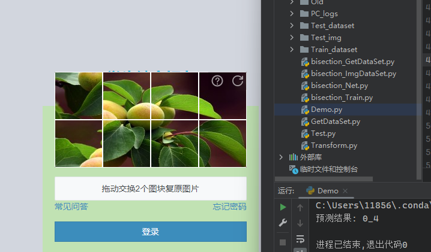

# Puzzle-Captcha-Breaker
Using this code to pass some jigsaw puzzle captcha!

这是一个基于深度学习模型搭建的对付推理拼图验证码的神经网络模型。

环境：Anaconda@python3.9.12

神经网络依赖库：Pytorch

训练卡：Nvidia RTX 3060

主要思路：AI判别给出图片是否为一个未完成的拼图，如果是未完成则输出0，完成输出1。捕获待解决的图片后对其进行穷举修改，让AI判别哪一张是正常的图片，最终输出。

若你感兴趣，可以将找到的图片放进material文件夹，运行Transform.py将图片转化为320X160输出至material_320_160文件夹，之后运行bisection_GetDataSet.py将图片文件输出到Train_dataset，Test_dataset（脚本默认随机输出一张调换位置的图片和一张原图，均带标签），之后运行bisection_Train.py开始训练。

之后可以根据代码注释，调用PassCode.py，完成对验证码的求解。

将待识别的图片文件转为320X160后放入Demo文件夹，运行Demo可得到预测结果。在后续开发时，发现Demo.py文件若改为仅仅搜索“1可能性最大”的结果正确率会更高。

Demo的效果可以查看Example.png。

以下是文件清单
    
    这里是对Demo做了一个整合，方便项目开发。
    -PassCode.py
        验证码图片运算
    -ImgDataTube.py
        将验证码图片发送到模型

-bisection_Net.py

    神经网络模型

-bisection_ImgDataSet.py

    重写DataSet

-bisection_GetDataSet.py

    获取所需的DataSet文件（将320X160的正常图片文件转化为拼图）

-bisection_Train.py
 
    训练文件

-Demo.py

    根据输入图片输出对应答案

-Transform.py

    将普通图片转化为320X160的图片

-Net_save

    -Net_save.pth
   
      最终模型（没有上传，实在是太大了）

-material

-material_320_160

-Demo

-Train_dataset

-Test_dataset
